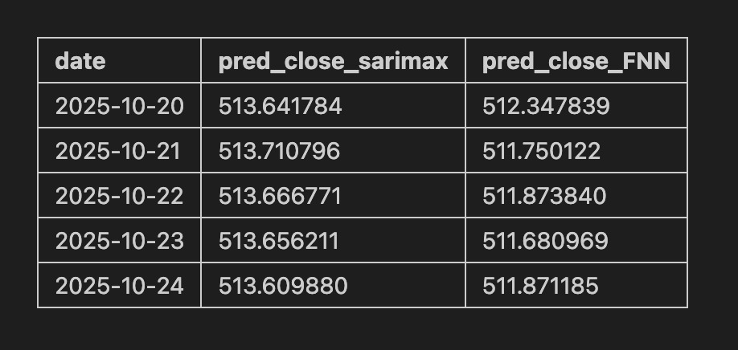

.. raw:: html

    <h1 style="color:#1565C0;">Metodología</h1>

.. raw:: html

    <h1 style="color:royalblue;">SARIMAX</h2>

- Selección de órdenes:

    Después de analizar ACF y PACF, se seleccionaron los siguientes parámetros para el modelo SARIMAX: (p=1, d=1, q=1) x (P=0, D=1, Q=1, s=5), tomando en cuenta el patrón semanal que son 5 días hábiles.

- Estacionalidad:

    Se consideraron los días laborales por lo que se incorporó un componente estacional con un periodo de 5 días.

- Variables exógenas:

    Incluyendo la serie de cierre, se usaron variables exógenas como los valores de apertura, máximo, mínimo y cambio porcentual diario. Nos ayudan a complementar todo el tema del precio y a mejorar la capacidad predictiva del modelo. Incluso algo importante, algo concluyente fue que se eligieron esas exógenas gracias a la gráfica de **ccf**. 

- Criterios de selección (AIC/BIC):

    Al analizar y hacer comparación entre distintas modificaciones del modelo utilizando los criterios AIC y BIC, se seleccionó el modelo con los valores más bajos de estos criterios, ya que indican un mejor ajuste del modelo a los datos con menor complejidad.

.. raw:: html

    <h1 style="color:royalblue;">FFNN</h2>    

- Selección de hiperparámetros:

    Se tuvo que considerar el número de lags, en este caso se usaron los últimos 7 días como entradas, para que aprendiera dependencias más recientes.

    Para las capas, está compuesta por tres ocultas densas con 64, 32 y 8 neuronas.

    Por otro lado, en la función de activación, se empleó la función **ReLU** en las capas ocultas, y una función lineal en la capa de salida para predecir valores continuos.

    Se aplicó `Adam` como optimizador y para la regularización se usó `EarlyStopping` (patience=15) para evitar el sobreajuste.

- Esquema de Walk-Forward y validación

    Este paso es primordial ya que se evalúa el desempeño del modelo y para entrenar conforme la serie temporal avanza(se actualiza) para lograr hacer pronósticos lo mejor posible. 

    Los pasos que se realizaron fueron la división del conjunto de datos en entrenamiento, validación y prueba. El modelo entrenado bajo este esquema generó los pronósticos para los siguientes 5 días hábiles (20–24 de octubre de 2025).

.. raw:: html

    <h1 style="color:royalblue;">Predicciones</h3> 

Predicciones:

